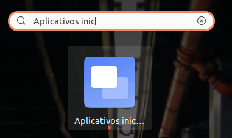

# Configurações e softwares instalados no Ubuntu

## Atribuir microfone default via linha de comando
- Listar os devices sources (entradas/microfone)
    - `pactl list short sources`
- Definir o microfone em execução
    - `pactl set-default-source alsa_input.usb-C-Media_Electronics_Inc._USB_Audio_Device-00.mono-fallback`
### Utilizando o crontab como solução
- Agendar no crontab no startup do sistema
    - `crontab -e -u nomedousuário`

        ```
        # Considere colocar o comando dentro do setAudioMicDefault.sh
        # Não esqueça de dar permissão de execução chmod +x
        @reboot sudo /home/setAudioMicDefault.sh &

        ```
### Utilizando no Gnome o "Preferências dos aplicativos iniciais de sessão"
Bom, este procedimento funcionou mais facilmente para mim. Legal que ele acaba executando logo que você inicia a sessão.

- Você pode abrir ele buscando pelo menu do sistema, progrando por "Aplicativos inic.." conforme imagem a seguir:
\
    

- Irá abrir a janela "Preferências dos aplicativos iniciais de sessão", basta configurar igual exemplo da imagem abaixo:
\
    

Pronto, agora quando logar, vai selecionar corretamente seu source/microfone.